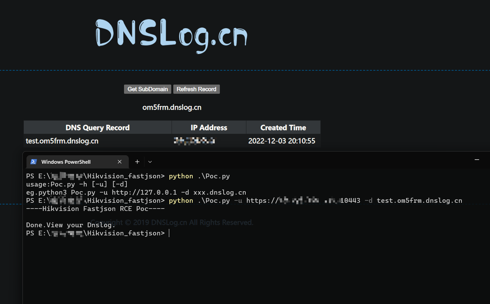

# Hikvision Fastjson Rce Poc

## Single target

`Poc.py`是单独对一个站点进行检测的，需要配合dnslog等`ldap://xxx`来进行测试

Example:

python3 Poc.py -u http://127.0.0.1 -d xxx.dnslog.cn

## Batch target

`batch_Hikvision_Fastjson.py`是对资产进行批量检测的

将目标放入`url.txt`，检测完成后将会输出到`result`文件夹下

- 批量检测精准度较低，需要使用`Poc.py`进行进一步验证
